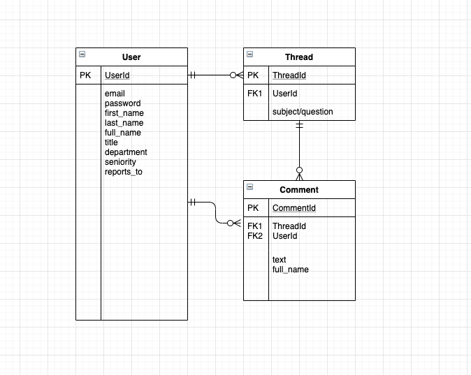

# CoPaw

Nobody dropping by your desk uninvited anymore? Give us a week to change that :smiling_imp: 
## Paws together! Let's goo!

<br>

## Project Planning

<br>

### Overview

**CoPaw** is an internal tool that is a hybrid between an employee directory and a social network. Users can sign up for an account, sign in, post messages to other users, and create/follow message boards or topics of their choice. They can also edit their own posts and delete them. As a post-MVP goal, users can comment on messages. CoPaw is built using React front-end and Ruby on Rails back-end. Lets paws together and don't forget to stay pawsitive!

<br>

### MVP

- _Web app built as an SPA(single-page app)_<br>
- _Use atleast one API to call and display information_<br>
- _Sign up_<br>
- _Sign in_<br>
- _Messaging board_<br>
- _Creation of messages_<br>
- _Editing of messages_<br>
- _Deletion of messages_<br>
- _Rails Backend (API)_<br>
- _React Frontend_<br>
- _Authentication_<br>
- _Flexbox_<br>
- _Nicely styled, ready for your portfolio, and ready to show employees!_<br>
- _Deployed on Surge/Heroku_<br>
- _Robust commit history_<br>
- _Code must be correctly indented and well styled_<br>
- _Remove console logs_<br>
- _README_<br>

<br>

#### Post-MVP Goals

- _3 related models (User plus two others)_<br>
- _3 associations (one-to-many or many-to-many)_<br>
- _404 Page_<br>
- _Search Bar_<br>
- _Weather API_<br>
- _Likes/Dislikes_<br>
- _Emojis_<br>

<br>

### Wireframes

Marvel: (?) <br>

#### Homepage


#### Sign Up


#### Sign In


#### User View/Profile View


#### Message Board


<br>

### ERD (Entity Relationship Diagram)



<br>

#### Component Estimates

| Task                  | Priority | Estimated Time | Actual Time |
| :-------------------: | :------: | :------------: | :---------: |
| Wireframe             |    H     |       ?        |      ?      |
| Initial Readme file   |    H     |       2 hrs    |      1 hr   |
| Backend Authentication|    H     |       4 hrs    |      4 hrs  |
| Backend Models        |    H     |       ?        |      ?      |
| API routes            |    H     |       ?        |      ?      |
| Frontend Auth & Links |    H     |       ?        |      ?      |
| Message CRUD          |    H     |       ?        |      ?      |
| Overall styling       |    H     |       ?        |      ?      |
| Final Readme file     |    H     |       ?        |      ?      |
| TOTAL                 |          |       ?        |      ?      |   

<br>


#### Libraries and API Endpoint Documentation

|     Library                          | Description                                                  |
| :----------------------------------: | :-----------------------------------------------------------:|
| Rails Documentation                  | _Ruby on Rails Library._                                     |
| React Router                         | _React Router Library._                                      |
| CSS Tricks                           | _For help while styling web app._                            |
| Weather API                          | _Third party API used to render weather into homepage on app._|
| StackOverflow                        | _For help while writing functional and class components._    |
| Unsplash                             | _For wireframing and main header photo._                     |
| GIPHY                                | _For videos used on Readme, loading spinner, and 404 page._  |
| Surge                                | _For deployment of front-end of web app._                    |
| Heroku                               | _For deployment of back-end of web app._                     |


<br>

### Technologies Used
-_Giphy_<br>
-_Unsplash_<br>
-_Marvel App_<br>
-_draw.io_<br>

<br>

### List of Server-Side Routes

|         Prefix       |   Verb   |                        URI Pattern                                 |       Controller#Action       |
| :-------------------:| :------: | :----------------------------------------------------------------: | :---------------------------: |
| auth_login           | POST     | /auth/login(.:format)                                              |  authentication#login         |
| auth_verify          | GET      | /auth/verify(.:format)                                             |  authentication#verify        |
| users                | GET      | /users(.:format)                                                   |  users#index                  |
|                      | POST     | /users(.:format)                                                   |  users#create                 |
| user                 | GET      | /users/:id(.:format)                                               |  users#show                   |
|                      | PATCH    | /users/:id(.:format)                                               |  users#update                 |
|                      | PUT      | /users/:id(.:format)                                               |  users#update                 |
|                      | DELETE   | /users/:id(.:format)                                               |  users#destroy                |

<br>

***

## Project Delivery

<br>

<br>
<h4>Stay Pawsitive!!</h4>

<br>

### Link to deployed site: 

Surge(front-end): (?) <br>

Heroku(Back-end): (?) <br>

### Installation Instructions

1. Clone repository down with 'git clone https://github.com/Sunnydayz77/CoPaw.git'
2. CD into repository
3. Run 'bundle install'
4. Run 'rails db:create'
5. Run 'rails db:migrate'
6. Run 'rails db:seed'
7. Run 'rails server' on 'http://localhost:3000/'
8. Create new terminal tab with 'command' + 't' on mac
9. CD in to client folder
10. Run 'npm install'
11. Run 'npm start' on 'http://localhost:3001/'


#### Helper Functions

|  Function  | Description                                |
| :--------: | :-----------------------------------------:|
| Footer     | _Footer function with links._              |

### Code Showcase

```
//Function

```

### Code Issues & Resolutions

| Error                                                                           | Resolution                                              |
| :-----------------------------------------------------------------------------: | :-----------------------------------------------------: |
| `error message`                                                                 |               How problem was solved                    |


### Link to deployed site (for quick reference while scrolling through readme file): 

Surge(front-end): (?) <br>

Heroku(Back-end): (?) <br>


***


