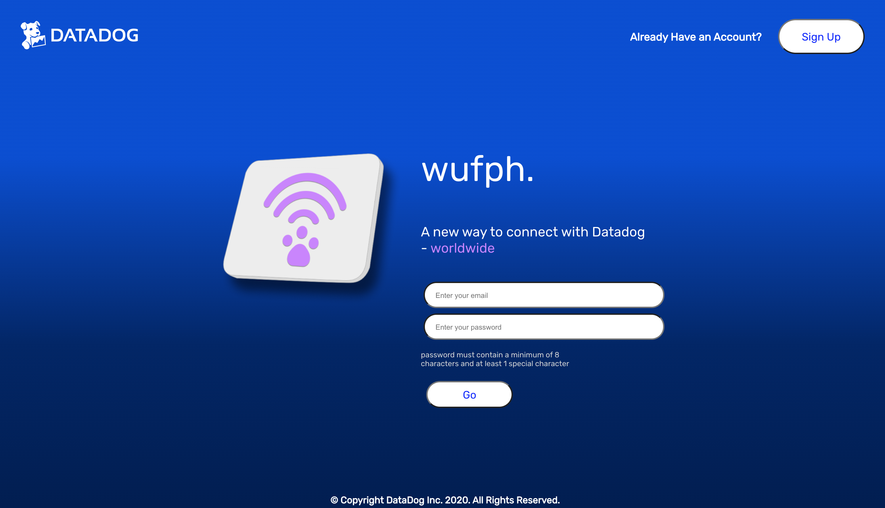

# CoPaw

Nobody dropping by your desk uninvited anymore? Give us a week to change that :smiling_imp: 

## Lets paws together and use CoPaw to stay connected!

<br>

## Project Planning

<br>

### Overview

**CoPaw** is an internal tool that is a hybrid between an employee directory and a social network. Users can sign up for an account, sign in, post messages to other users, and create/follow message boards or topics based on interest. They can also edit their own posts and delete them. As a post-MVP goal, coworkers will be able to see to where other users are logging in from on a world map. CoPaw is built using React front-end and Ruby on Rails back-end. Lets paws together and don't forget to stay pawsitive!

<br>

### MVP

- _Web app built as an SPA(single-page app)_<br>
- _Use atleast one API to call and display information_<br>
- _Sign up_<br>
- _Sign in_<br>
- _Search Bar_<br>
- _Messaging board_<br>
- _Creation of messages_<br>
- _Editing of messages_<br>
- _Deletion of messages_<br>
- _Rails Backend (API)_<br>
- _React Frontend_<br>
- _Authentication_<br>
- _Flexbox_<br>
- _Nicely styled and ready for a portfolio_<br>
- _Deployed on Surge/Heroku_<br>
- _Robust commit history_<br>
- _Code is correctly indented and well styled_<br>
- _Console logs removed_<br>
- _Readme created_<br>

<br>

#### Post-MVP Goals

- _3 related models (User plus two others)_<br>
- _3 associations (one-to-many or many-to-many)_<br>
- _Worldwide map and coworker locator_<br>
- _404 Page_<br>
- _Weather API_<br>
- _Likes/Dislikes_<br>
- _Emojis_<br>

<br>

### Wireframes

#### Homepage


#### Sign Up


#### Sign In


#### Profile View


#### Message Board


#### Worldwide Coworker Locations


<br>

### ERD (Entity Relationship Diagram)


<br>


#### Libraries and API Endpoint Documentation

|     Library                          | Description                                                  |
| :----------------------------------: | :-----------------------------------------------------------:|
| Rails Documentation                  | _Ruby on Rails Library._                                     |
| React Router                         | _React Router Library._                                      |
| CSS Tricks                           | _For help while styling web app._                            |
| Secret Key API                       | _Third party API used to render secret key for sign up._     |
| StackOverflow                        | _For help while writing functional and class components._    |
| GIPHY                                | _For videos used on Readme, loading spinner, and 404 page._  |
| Surge                                | _For deployment of front-end of web app._                    |
| Heroku                               | _For deployment of back-end of web app._                     |


<br>

### Technologies Used
-_Zeplin_<br>
-_Sketch_<br>
-_Figma_<br>
-_draw.io_<br>
-_Google Fonts_<br>
-_Giphy_<br>


<br>

### List of Server-Side Routes

|         Prefix       |   Verb   |                        URI Pattern                                 |       Controller#Action       |
| :-------------------:| :------: | :----------------------------------------------------------------: | :---------------------------: |
| auth_login           | POST     | /auth/login(.:format)                                              |  authentication#login         |
| auth_verify          | GET      | /auth/verify(.:format)                                             |  authentication#verify        |
| users                | GET      | /users(.:format)                                                   |  users#index                  |
|                      | POST     | /users(.:format)                                                   |  users#create                 |
| user                 | GET      | /users/:id(.:format)                                               |  users#show                   |
|                      | PATCH    | /users/:id(.:format)                                               |  users#update                 |
|                      | PUT      | /users/:id(.:format)                                               |  users#update                 |
|                      | DELETE   | /users/:id(.:format)                                               |  users#destroy                |

<br>

***

## Project Delivery

<br>

<br>
<h4>Stay Pawsitive!!</h4>

<br>

### Link to deployed site: 

Surge(front-end): (http://www.copaw.surge.sh/) <br>

Heroku(Back-end): (https://copaw.herokuapp.com) <br>

### Installation Instructions For Local Machine

1. Clone repository down with 'git clone https://github.com/Sunnydayz77/CoPaw.git'
2. CD into repository
3. Run 'bundle install'
4. Run 'rails db:create'
5. Run 'rails db:migrate RAILS_ENV=development'
6. Run 'rails db:seed'
7. Run 'rails server' on 'http://localhost:3000/'
8. Create new terminal tab with 'command' + 't' on mac
9. CD in to client folder
10. Run 'npm install'
11. Run 'npm install --save axios'
12. Run 'npm start' on 'http://localhost:3001/'


### Code Showcase

```
//Code that allows a user to add an interest to their profile

class CreateInterest extends Component {

  constructor(props) {
    super(props);
    this.state = {
      interestData: {
        text: ''
      }
    }
  }

  handleChange = async (e) => {
    const { name, value } = e.target;
    this.setState(prevState => ({
      interestData: {
        ...prevState.interestData,
        [name]: value
      }
    }));
  }


  handleCreate = async (e) => {
    e.preventDefault();
    const existingInterest = await findInterest(this.state.interestData.text)
    if (existingInterest[0]) {
      addProfileToInterest(existingInterest[0].id, this.props.profile_id)
    }
    else {
      createInterest(this.state.interestData, this.props.profile_id)
    }
  }

  render() {
    return (
      <div className='create-interest'>
        <div className="interest-create-container">
          <form className='interest-form' onSubmit={this.handleCreate} >
            <div className='form-field'>
              <input name="text" type="text" placeholder='Crocheting'
                value={this.state.interestData.text} onChange={this.handleChange}
              />
            </div>

            <button>Add</button>
          </form>
        </div>
      </div>
    )

  }

}

export default CreateInterest;

```


### Link to deployed site (for quick reference while scrolling through readme file): 

Surge(front-end): (http://www.copaw.surge.sh/) <br>

Heroku(Back-end): (https://copaw.herokuapp.com) <br>


***


